# E2E Test Platform — Architecture Document

## Table of Contents

1. [System Context](#1-system-context)
2. [Container Diagram](#2-container-diagram)
3. [Component Diagram](#3-component-diagram)
4. [Deployment Architecture](#4-deployment-architecture)
5. [Key Sequence Flows](#5-key-sequence-flows)
6. [State Machines](#6-state-machines)
7. [Data Flow](#7-data-flow)
8. [Entity Relationship](#8-entity-relationship)
9. [AI Pipeline](#9-ai-pipeline)
10. [Security Model](#10-security-model)
11. [API Contracts](#11-api-contracts)
12. [Convex Configuration](#12-convex-configuration)

---

## 1. System Context

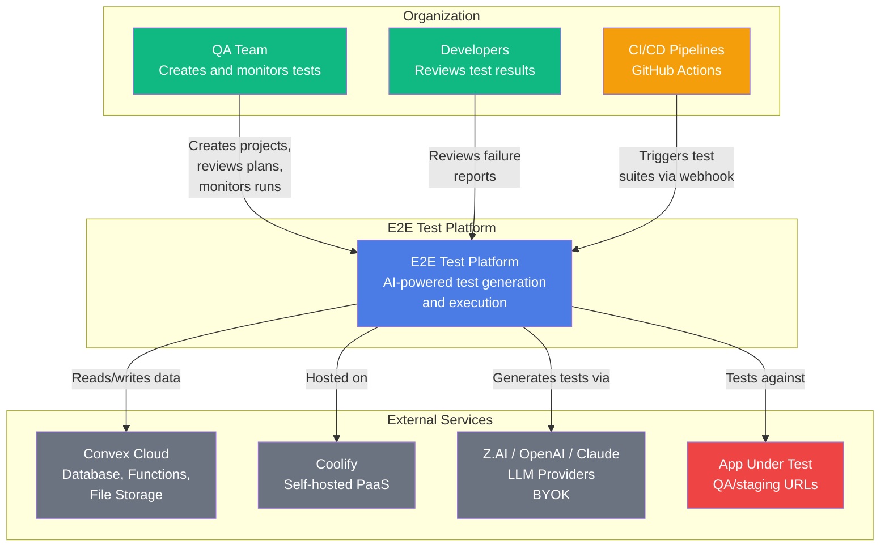

---

## 2. Container Diagram

```mermaid
graph TB
    subgraph "Browser"
        Chromium[Chromium Browser<br/>Playwright-controlled]
    end

    subgraph "Coolify Server"
        subgraph "Next.js Container"
            Dashboard[Web Dashboard<br/>Next.js App Router<br/>React + Tailwind]
            APIRoutes[API Routes<br/>Webhooks, Auth]
        end

        subgraph "Test Agent (Cloud Mode)"
            AgentCLI[Agent CLI<br/>Node.js daemon]
            Runner[Playwright Runner<br/>Test execution]
            Analyzer[Page Analyzer<br/>DOM + screenshots]
            Explorer[App Explorer<br/>Autonomous navigation]
        end
    end

    subgraph "Convex Cloud"
        Functions[Convex Functions<br/>Mutations, Queries, Actions]
        DB[(Convex Database<br/>All app data)]
        Storage[File Storage<br/>Screenshots, PRDs]
        Workpool[Workpool Component<br/>Job queue + parallelism]
        BetterAuth[Better Auth Component<br/>Auth + Organizations]
    end

    subgraph "QA Dev Machine"
        AgentLocal[Test Agent (Local Mode)<br/>Same codebase as cloud agent]
        LocalBrowser[Chromium Browser<br/>For localhost testing]
    end

    subgraph "External"
        LLMProviders[LLM Providers<br/>Z.AI, OpenAI, Claude]
        CIWebhook[CI/CD Pipeline<br/>GitHub Actions]
    end

    Dashboard -->|HTTP/JSON| Functions
    Dashboard -->|Realtime subscriptions| Functions
    APIRoutes -->|Create test_run| Functions
    Functions -->|Read/write| DB
    Functions -->|Store/fetch| Storage
    Functions -->|Enqueue jobs| Workpool
    Functions -->|Auth validation| BetterAuth
    Functions -->|LLM calls via BYOK| LLMProviders

    AgentCLI -->|Poll for jobs| Workpool
    AgentCLI -->|Heartbeat| Functions
    AgentCLI -->|Update run status| Functions
    AgentCLI -->|Upload artifacts| Storage
    AgentCLI -->|Launch| Runner
    AgentCLI -->|Launch| Analyzer
    AgentCLI -->|Launch| Explorer
    Runner -->|Controls| Chromium
    Analyzer -->|Captures DOM from| Chromium
    Explorer -->|Navigates| Chromium
    Chromium -->|Tests| AppTarget

    AgentLocal -->|Same patterns as AgentCLI| Functions
    AgentLocal -->|Controls| LocalBrowser
    LocalBrowser -->|Tests| LocalApp[localhost / VPN Apps]

    CIWebhook -->|POST /api/webhooks/run-tests| APIRoutes

    style Dashboard fill:#4B7BE5,color:#fff
    style APIRoutes fill:#4B7BE5,color:#fff
    style AgentCLI fill:#3B82F6,color:#fff
    style Runner fill:#3B82F6,color:#fff
    style Analyzer fill:#3B82F6,color:#fff
    style Explorer fill:#3B82F6,color:#fff
    style Functions fill:#10B981,color:#fff
    style DB fill:#10B981,color:#fff
    style Storage fill:#10B981,color:#fff
    style Workpool fill:#059669,color:#fff
    style BetterAuth fill:#059669,color:#fff
    style AgentLocal fill:#8B5CF6,color:#fff
    style LocalBrowser fill:#8B5CF6,color:#fff
    style Chromium fill:#EF4444,color:#fff
```

---

## 3. Component Diagram

### 3a. Next.js Dashboard

```mermaid
graph TB
    subgraph "Next.js App"
        subgraph "Pages (app/ directory)"
            Layout[Dashboard Layout<br/>Sidebar + Auth Guard]
            ProjectList[Project List<br/>/dashboard/projects]
            ProjectDetail[Project Detail<br/>/dashboard/projects/[id]]
            TestPlan[Test Plan Review<br/>/dashboard/projects/[id]/tests]
            RunDetail[Run Results<br/>/dashboard/projects/[id]/runs/[runId]]
            Settings[Settings<br/>Credentials, API Keys]
        end

        subgraph "API Routes"
            Webhook[POST /api/webhooks/run-tests]
            AuthRoutes[Auth Handlers<br/>Better Auth]
        end

        subgraph "Shared Components"
            UI[UI Primitives<br/>Button, Card, Modal, Table]
            ProjectComponents[Project Components]
            TestComponents[Test Case Components]
            RunComponents[Run/Report Components]
            ExploreComponents[Explore Phase Components]
        end

        subgraph "Client Lib"
            ConvexClient[Convex Client<br/>useQuery, useMutation]
            Utils[Utilities]
        end

        Layout --> ProjectList
        Layout --> ProjectDetail
        Layout --> Settings
        ProjectDetail --> TestPlan
        ProjectDetail --> RunDetail
        ProjectDetail --> ExploreComponents
        ProjectList --> ProjectComponents
        TestPlan --> TestComponents
        RunDetail --> RunComponents
        Pages --> ConvexClient
        Webhook --> ConvexClient
        AuthRoutes --> ConvexClient
        ConvexClient --> Utils
    end

    style Layout fill:#4B7BE5,color:#fff
    style ProjectList fill:#4B7BE5,color:#fff
    style ProjectDetail fill:#4B7BE5,color:#fff
    style Webhook fill:#F59E0B,color:#fff
```

### 3b. Convex Backend

```mermaid
graph TB
    subgraph "Convex Backend"
        subgraph "Function Modules"
            Projects[projects.ts<br/>Project CRUD]
            TestSuites[testSuites.ts<br/>Suite management]
            TestCases[testCases.ts<br/>Test case lifecycle]
            TestRuns[testRuns.ts<br/>Run orchestration]
            PRD[prd.ts<br/>PRD parsing + feature extraction]
            Explore[explore.ts<br/>Explore orchestration]
            Plan[plan.ts<br/>AI plan generation]
            Generate[generate.ts<br/>Playwright code gen]
            Analyze[analyze.ts<br/>AI failure analysis]
            Workers[workers.ts<br/>Registration + heartbeat]
            Credentials[credentials.ts<br/>Encrypted storage]
            Scheduling[scheduling.ts<br/>Scheduled run logic]
            Crons[crons.ts<br/>Cron definitions]
            LLM[llm.ts<br/>BYOK abstraction]
        end

        subgraph "Schema"
            Schema[schema.ts<br/>All table definitions]
        end

        subgraph "Components"
            WP[Workpool<br/>@convex-dev/workpool]
            BA[Better Auth<br/>@convex-dev/better-auth]
        end

        subgraph "Convex Config"
            Config[convex.config.ts<br/>Component wiring]
        end

        Projects --> Schema
        TestSuites --> Schema
        TestCases --> Schema
        TestRuns --> Schema
        PRD --> LLM
        Explore --> LLM
        Plan --> LLM
        Generate --> LLM
        Analyze --> LLM
        TestRuns --> WP
        Workers --> BA
        Projects --> BA
        WP --> Config
        BA --> Config
    end

    style Projects fill:#10B981,color:#fff
    style TestRuns fill:#10B981,color:#fff
    style PRD fill:#10B981,color:#fff
    style Plan fill:#10B981,color:#fff
    style LLM fill:#059669,color:#fff
    style Schema fill:#047857,color:#fff
    style WP fill:#059669,color:#fff
    style BA fill:#059669,color:#fff
```

### 3c. Test Agent

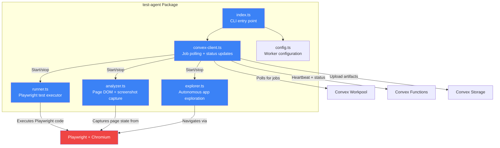

---

## 4. Deployment Architecture

```mermaid
graph TB
    subgraph "Coolify Server (Self-Hosted)"
        subgraph "Docker Network"
            NextJS[Next.js App<br/>Port 3000<br/>Dashboard + API routes]
            CloudWorker[Cloud Test Agent<br/>Headless daemon<br/>Polls for + runs jobs]
        end

        PlaywrightInstall[Playwright + Chromium<br/>Installed on host<br/>Accessed by CloudWorker]
    end

    subgraph "Convex Cloud"
        CFunctions[Convex Functions Runtime]
        CDB[(Convex Database)]
        CStorage[Convex File Storage]
        CCrons[Convex Cron Engine]
    end

    subgraph "QA Dev Machine"
        LocalAgent[Local Test Agent<br/>Daemon process<br/>Registered via API key]
        LocalPlaywright[Playwright + Chromium<br/>For localhost/internal app testing]
    end

    subgraph "CI/CD Pipeline"
        GitHub[GitHub Actions<br/>Post-deploy step]
    end

    subgraph "LLM Providers"
        ZAI[Z.AI / GLM<br/>BYOK]
        OpenAI[OpenAI GPT-4o<br/>BYOK]
        Claude[Anthropic Claude<br/>BYOK (future)]
    end

    NextJS -->|API calls| CFunctions
    NextJS -->|Realtime subscriptions| CFunctions
    NextJS -->|Serves dashboard| UsersBrowser[User's Browser]

    CloudWorker -->|Poll + execute| CFunctions
    CloudWorker -->|Upload screenshots| CStorage
    CloudWorker -->|Uses| PlaywrightInstall
    PlaywrightInstall -->|Tests| PublicApp[Public QA URLs]

    LocalAgent -->|Poll + execute| CFunctions
    LocalAgent -->|Upload screenshots| CStorage
    LocalAgent -->|Uses| LocalPlaywright
    LocalPlaywright -->|Tests| LocalApp[localhost / VPN Apps]

    CFunctions -->|LLM calls| ZAI
    CFunctions -->|LLM calls| OpenAI
    CFunctions -->|LLM calls| Claude

    GitHub -->|POST /api/webhooks| NextJS

    style NextJS fill:#4B7BE5,color:#fff
    style CloudWorker fill:#3B82F6,color:#fff
    style PlaywrightInstall fill:#EF4444,color:#fff
    style CFunctions fill:#10B981,color:#fff
    style CDB fill:#047857,color:#fff
    style CStorage fill:#047857,color:#fff
    style LocalAgent fill:#8B5CF6,color:#fff
    style LocalPlaywright fill:#8B5CF6,color:#fff
```

---

## 5. Key Sequence Flows

### 5a. Project Setup → Explore → Plan → Run → Results

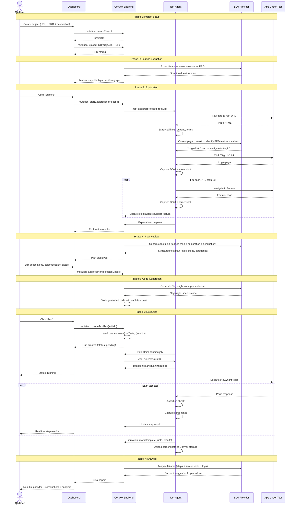

### 5b. Test Execution Flow (Workpool Detail)

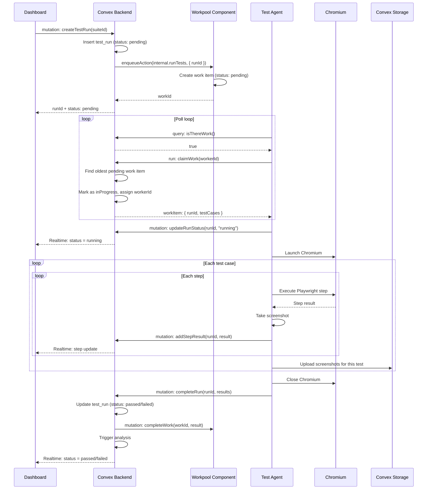

### 5c. Worker Registration + Heartbeat

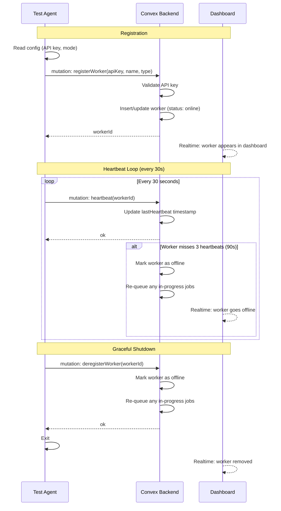

### 5d. CI Webhook → Test Run

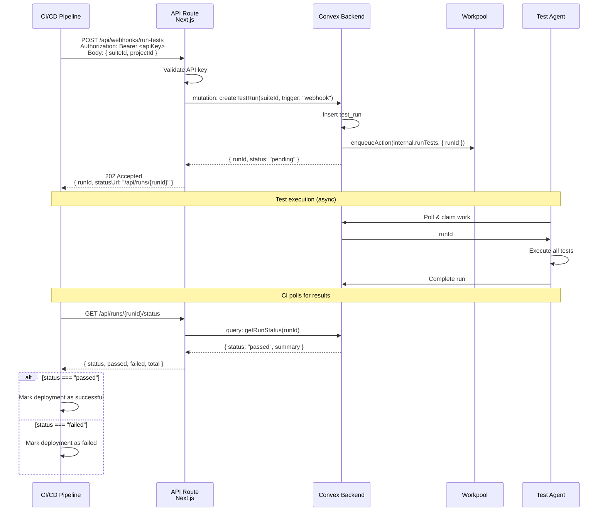

### 5e. AI Failure Analysis

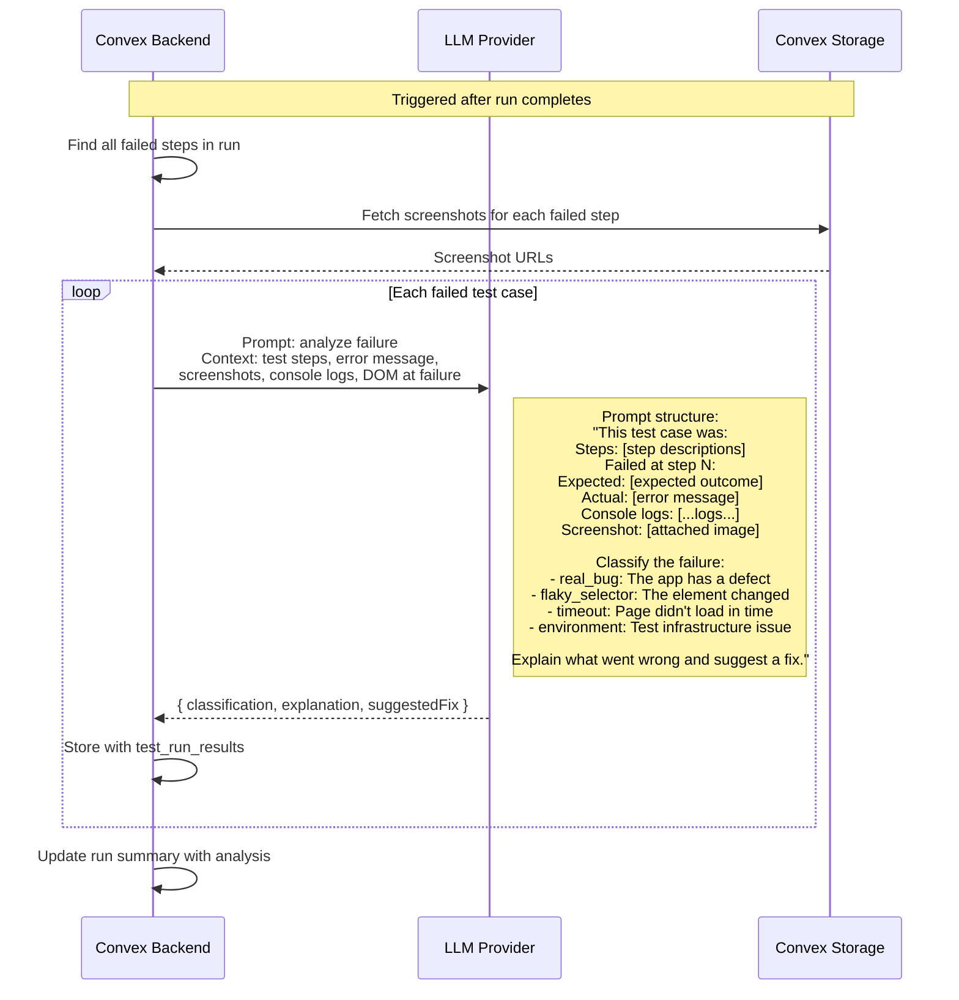

---

## 6. State Machines

### 6a. Test Run States

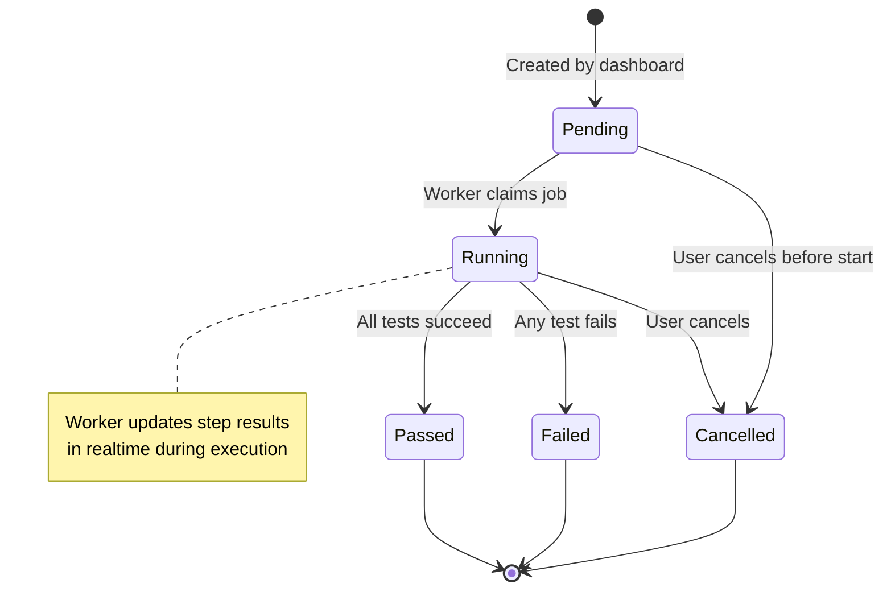

### 6b. Test Case States

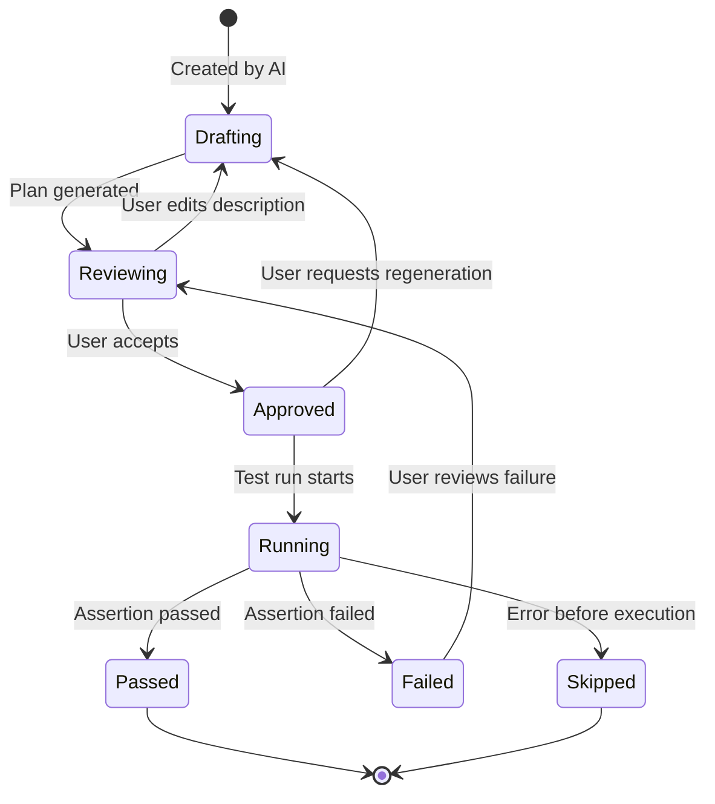

### 6c. Worker States

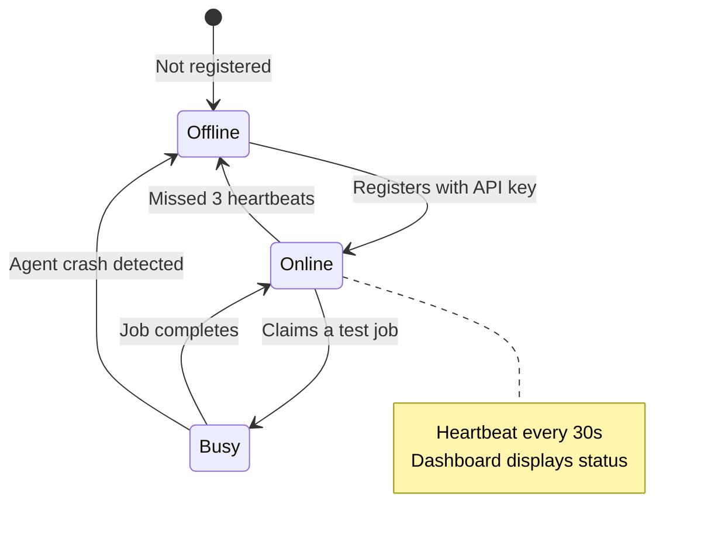

### 6d. Explore Phase States

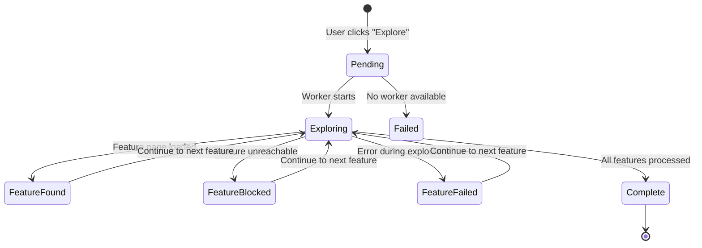

---

## 7. Data Flow

### 7a. Test Lifecycle Data Flow

```mermaid
flowchart LR
    subgraph "Phase 1: Setup"
        A[User Input<br/>URL + PRD + Description]
        B[PRD Storage<br/>Convex Storage]
    end

    subgraph "Phase 2: Extract"
        C[PRD Text<br/>Extracted content]
        D[Feature Map<br/>Structured JSON]
    end

    subgraph "Phase 3: Explore"
        E[Page DOM + Screenshots]
        F[Feature Reachability Map]
    end

    subgraph "Phase 4: Plan"
        G[Test Plan<br/>Natural language steps]
        H[User Review + Approval]
    end

    subgraph "Phase 5: Generate"
        I[Playwright Code<br/>.spec.ts per test case]
    end

    subgraph "Phase 6: Execute"
        J[Test Run Results<br/>Step statuses + screenshots]
    end

    subgraph "Phase 7: Analyze"
        K[Failure Analysis<br/>Classification + explanation]
    end

    A -->|upload| B
    B -->|extract text| C
    C -->|LLM extract| D
    D -->|guide navigation| E
    E -->|plan input| G
    G -->|review & edit| H
    H -->|generate code| I
    I -->|execute| J
    J -->|analyze failures| K

    style A fill:#4B7BE5,color:#fff
    style D fill:#10B981,color:#fff
    style G fill:#10B981,color:#fff
    style I fill:#F59E0B,color:#fff
    style J fill:#3B82F6,color:#fff
    style K fill:#EF4444,color:#fff
```

### 7b. Data Ownership & Flow Between Systems

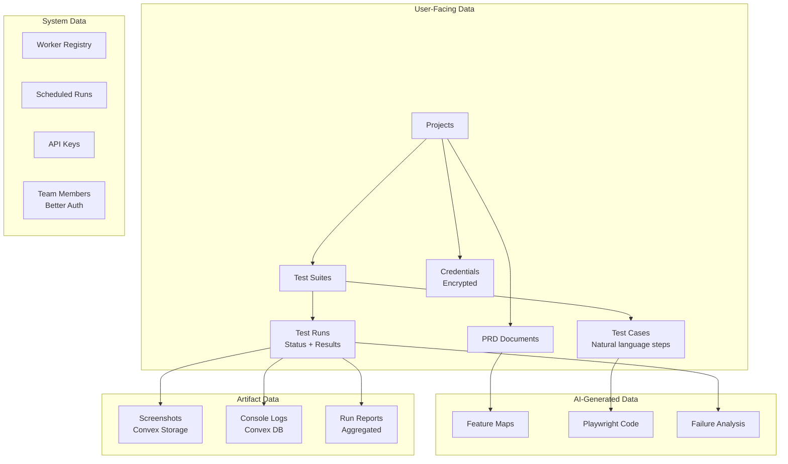

---

## 8. Entity Relationship

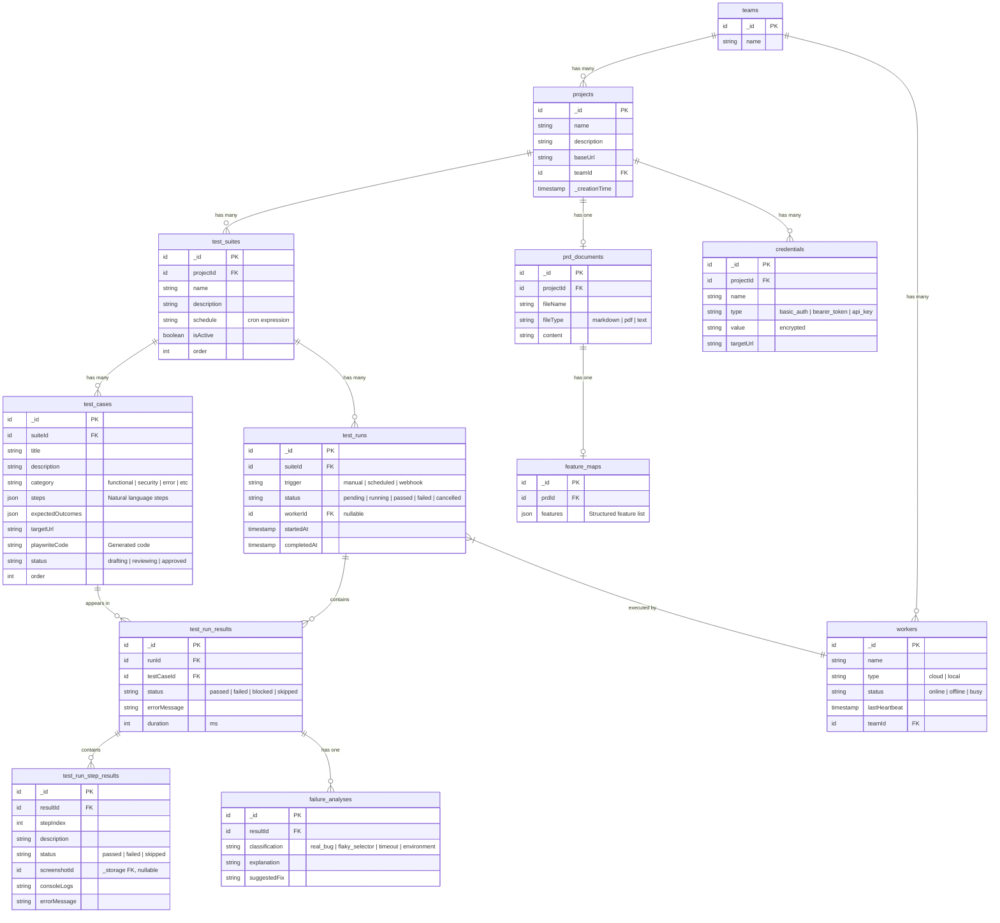

---

## 9. AI Pipeline

### 9a. LLM Abstraction Interface

```typescript
// lib/llm/index.ts — shared between Convex actions and test agent

interface LLMProvider {
  generateText(prompt: string, options?: LLMOptions): Promise<string>;
  generateWithImages(
    prompt: string,
    images: Array<{ url: string; detail?: "low" | "high" }>,
    options?: LLMOptions
  ): Promise<string>;
}

interface LLMOptions {
  model?: string;
  temperature?: number;
  maxTokens?: number;
  systemPrompt?: string;
}

// Provider implementations:
// - OpenAICompatibleProvider: works with Z.AI, OpenAI, any OpenAI-compatible API
// - AnthropicProvider: Claude API (future)
```

### 9b. BYOK Key Management

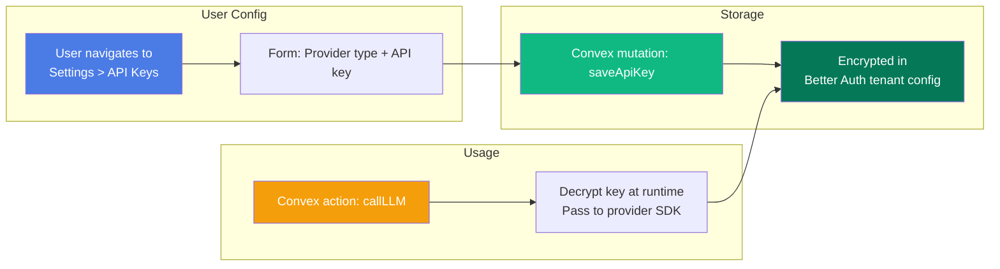

### 9c. Prompt Structure Per Phase

#### PRD → Feature Map
```
System: You are a QA analyst extracting features from a product requirements document.
Extract all features and their associated use cases as a structured JSON array.

Document: {prd_text}

Output format:
{
  "features": [
    {
      "name": "User Authentication",
      "useCases": [
        "User can sign up with email and password",
        "User can log in with valid credentials",
        "User sees error on invalid credentials"
      ],
      "category": "auth"
    }
  ]
}
```

#### Explore Phase (Agent Guidance)
```
System: You are guiding an automated browser through a web application.
You are given a feature to find and explore. Describe which link or button
to click next based on the current page content.

Current URL: {url}
Current page summary: {dom_summary}
Feature to find: {feature_name}
Use case: {use_case}

Respond with the action to take:
- CLICK: {element description or selector}
- NAVIGATE: {url path}
- DONE: Feature found and explored
- BLOCKED: Cannot find this feature
```

#### Plan Generation
```
System: You are a QA engineer creating a test plan for a web application.
Given the feature map and exploration results, generate structured test cases.

Features: {feature_map}
Exploration results: {exploration_data}
User instructions: {user_description}
Test credentials available: {has_credentials}

Generate test cases. Each must have:
1. A descriptive title
2. A natural language description
3. A category (functional / security / error_handling)
4. Step-by-step actions in natural language
5. Expected outcomes per step
```

#### Code Generation
```
System: Generate Playwright TypeScript test code from the following
natural language test case specification.

Test title: {title}
Steps: {steps}
Expected outcomes: {outcomes}
Target URL: {url}

Rules:
- Use data-testid selectors when element text is unique
- Fallback to text selectors: page.getByText()
- Fallback to role selectors: page.getByRole()
- Use page.goto() for navigation
- Use page.waitForSelector() or locator.waitFor() for timing
- Use expect() for assertions
- Each step should be a separate logical block with a comment
- Handle errors gracefully with try/catch per step
```

#### Failure Analysis
```
System: Analyze this test failure and classify the root cause.

Test title: {test_title}
Steps: {steps}
Failed at step N: {failed_step}
Expected: {expected_outcome}
Actual error: {error_message}
Console logs: {console_logs}
Screenshot: [attached image]

Classify failure as one of:
1. real_bug — The application has a defect
2. flaky_selector — The UI element selector needs updating
3. timeout — Page or element didn't load in expected time
4. environment — Test infrastructure issue (network, auth, etc.)

Provide:
- Classification
- Explanation of what went wrong
- Suggested fix
```

---

## 10. Security Model

### 10a. Authentication Flow

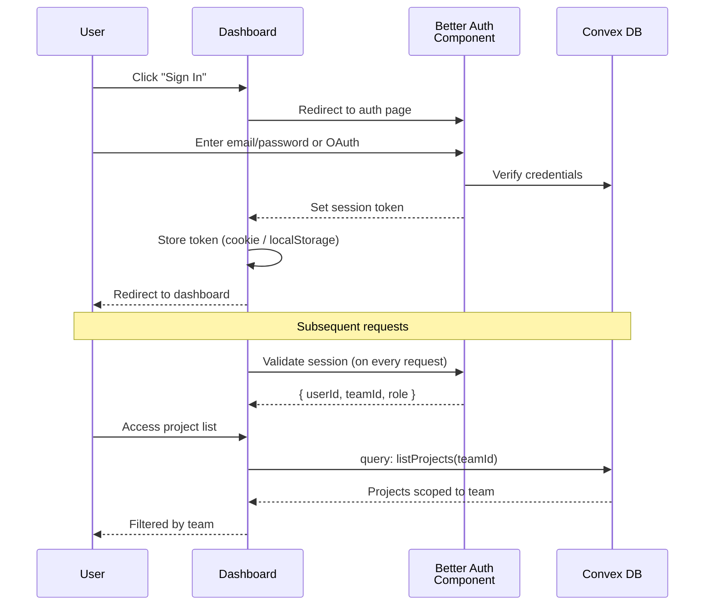

### 10b. Tenant Isolation

- Every row in every table is scoped by `teamId` (from Better Auth organizations)
- All Convex queries and mutations validate `teamId === currentUser.teamId`
- The `workers` table also scopes to `teamId` — each team has their own workers
- Worker API keys are generated per-team via the dashboard
- CI webhook API keys are generated per-team/project

### 10c. Worker Authentication

```mermaid
flowchart LR
    subgraph "Worker Registration"
        W[Worker starts] -->|Reads config| C[Config file:<br/>teamId + apiKey]
        C -->|registerWorker mutation| V[Convex validates API key]
        V -->|Matches team record| S[Worker registered<br/>scoped to team]
    end

    subgraph "Worker Claims Job"
        worker[Registered Worker] -->|claimWork mutation| CV[Convex validates:<br/>1. API key matches worker<br/>2. Worker belongs to team<br/>3. Job belongs to team]
        CV -->|All pass| J[Job assigned]
    end

    style W fill:#3B82F6,color:#fff
    style worker fill:#3B82F6,color:#fff
    style V fill:#10B981,color:#fff
    style CV fill:#10B981,color:#fff
```

### 10d. CI Webhook Authentication

```
Request:
  POST /api/webhooks/run-tests
  Authorization: Bearer <api-key>
  Content-Type: application/json
  Body: { suiteId, projectId }

Validation:
  1. API route reads Authorization header
  2. Looks up API key in Convex api_keys table
  3. Validates key is active and belongs to team
  4. Validates suiteId belongs to same team
  5. Creates test_run scoped to that team
  6. Returns 202 with runId

Response:
  202 Accepted
  { runId, status: "pending", statusUrl: "/api/runs/{runId}" }
```

### 10e. BYOK Key Security

- LLM API keys are stored encrypted in the Convex database
- Keys are decrypted only within Convex actions at runtime
- Keys are never exposed to the client
- The BYOK key is stored per-team (all members share one set of keys)
- Optional: user can set a separate key per project

---

## 11. API Contracts

### 11a. Convex Mutations

```typescript
// ─── Projects ───
export const createProject = mutation({
  args: { name: v.string(), description: v.optional(v.string()), baseUrl: v.string() },
  returns: v.id("projects"),
  handler: async (ctx, args) => { /* ... */ },
});

export const updateProject = mutation({
  args: { projectId: v.id("projects"), name: v.optional(v.string()), baseUrl: v.optional(v.string()) },
  returns: v.null(),
});

// ─── PRD ───
export const uploadPRD = mutation({
  args: { projectId: v.id("projects"), content: v.string(), fileName: v.string(), fileType: v.string() },
  returns: v.null(),
});

export const extractFeatureMap = mutation({
  args: { projectId: v.id("projects") },
  returns: v.null(),
});

// ─── Explore ───
export const startExploration = mutation({
  args: { projectId: v.id("projects") },
  returns: v.id("test_runs"),
});

export const updateFeatureExplorationStatus = internalMutation({
  args: { projectId: v.id("projects"), featureName: v.string(), status: v.string(), domSnapshot: v.optional(v.string()) },
  returns: v.null(),
});

// ─── Test Suites ───
export const createSuite = mutation({
  args: { projectId: v.id("projects"), name: v.string(), description: v.optional(v.string()) },
  returns: v.id("test_suites"),
});

// ─── Test Plans ───
export const generatePlan = mutation({
  args: { projectId: v.id("projects") },
  returns: v.null(),
});

export const saveApprovedPlan = mutation({
  args: { projectId: v.id("projects"), selectedTestCaseIds: v.array(v.id("test_cases")) },
  returns: v.null(),
});

export const regenerateTestCase = mutation({
  args: { testCaseId: v.id("test_cases"), newDescription: v.string() },
  returns: v.null(),
});

// ─── Test Execution ───
export const createTestRun = mutation({
  args: { suiteId: v.id("test_suites"), trigger: v.string() },
  returns: v.id("test_runs"),
});

export const updateRunStatus = internalMutation({
  args: { runId: v.id("test_runs"), status: v.string(), workerId: v.optional(v.string()) },
  returns: v.null(),
});

export const addStepResult = internalMutation({
  args: {
    runId: v.id("test_runs"),
    testCaseId: v.id("test_cases"),
    stepIndex: v.number(),
    description: v.string(),
    status: v.string(),
    errorMessage: v.optional(v.string()),
  },
  returns: v.id("test_run_step_results"),
});

export const completeRun = internalMutation({
  args: { runId: v.id("test_runs"), results: v.array(v.object({
    testCaseId: v.id("test_cases"),
    status: v.string(),
    errorMessage: v.optional(v.string()),
    duration: v.number(),
  })) },
  returns: v.null(),
});

// ─── Workers ───
export const registerWorker = mutation({
  args: { name: v.string(), type: v.string() },
  returns: v.id("workers"),
});

export const heartbeat = mutation({
  args: { workerId: v.id("workers") },
  returns: v.null(),
});

export const claimWork = mutation({
  args: { workerId: v.id("workers") },
  returns: v.union(v.null(), v.object({ runId: v.id("test_runs"), suiteId: v.id("test_suites") })),
});

// ─── Credentials ───
export const saveCredentials = mutation({
  args: { projectId: v.id("projects"), name: v.string(), type: v.string(), value: v.string(), targetUrl: v.string() },
  returns: v.id("credentials"),
});

// ─── CI Webhook ───
export const validateWebhookKey = mutation({
  args: { apiKey: v.string() },
  returns: v.union(v.null(), v.object({ teamId: v.id("teams") })),
});
```

### 11b. Convex Queries

```typescript
export const listProjects = query({
  args: {},
  returns: v.array(v.object({
    _id: v.id("projects"),
    name: v.string(),
    description: v.optional(v.string()),
    baseUrl: v.string(),
    _creationTime: v.number(),
  })),
});

export const getProject = query({
  args: { projectId: v.id("projects") },
  returns: v.union(v.null(), v.object({
    _id: v.id("projects"),
    name: v.string(),
    description: v.optional(v.string()),
    baseUrl: v.string(),
    _creationTime: v.number(),
  })),
});

export const listTestSuites = query({
  args: { projectId: v.id("projects") },
  returns: v.array(v.object({
    _id: v.id("test_suites"),
    name: v.string(),
    description: v.optional(v.string()),
    schedule: v.optional(v.string()),
    isActive: v.boolean(),
  })),
});

export const getTestCasesBySuite = query({
  args: { suiteId: v.id("test_suites") },
  returns: v.array(v.object({
    _id: v.id("test_cases"),
    title: v.string(),
    description: v.string(),
    category: v.string(),
    steps: v.array(v.string()),
    status: v.string(),
    order: v.number(),
  })),
});

export const getRunResults = query({
  args: { runId: v.id("test_runs") },
  returns: v.array(v.object({
    _id: v.id("test_run_results"),
    testCaseId: v.id("test_cases"),
    status: v.string(),
    errorMessage: v.optional(v.string()),
    duration: v.number(),
    steps: v.array(v.object({
      stepIndex: v.number(),
      description: v.string(),
      status: v.string(),
      screenshotUrl: v.optional(v.string()),
      errorMessage: v.optional(v.string()),
    })),
    failureAnalysis: v.optional(v.object({
      classification: v.string(),
      explanation: v.string(),
      suggestedFix: v.string(),
    })),
  })),
});

export const getRunHistory = query({
  args: { suiteId: v.id("test_suites"), limit: v.optional(v.number()) },
  returns: v.array(v.object({
    _id: v.id("test_runs"),
    trigger: v.string(),
    status: v.string(),
    startedAt: v.number(),
    completedAt: v.optional(v.number()),
    passedCount: v.number(),
    failedCount: v.number(),
  })),
});

export const listWorkers = query({
  args: {},
  returns: v.array(v.object({
    _id: v.id("workers"),
    name: v.string(),
    type: v.string(),
    status: v.string(),
    lastHeartbeat: v.number(),
  })),
});

export const isThereWork = query({
  args: {},
  returns: v.boolean(),
});

export const getFeatureMap = query({
  args: { projectId: v.id("projects") },
  returns: v.union(v.null(), v.object({
    features: v.array(v.object({
      name: v.string(),
      useCases: v.array(v.string()),
      category: v.string(),
      explorationStatus: v.optional(v.string()),
    })),
  })),
});
```

### 11c. Next.js API Routes

```typescript
// POST /api/webhooks/run-tests
// Headers: Authorization: Bearer <api-key>
// Body: { suiteId: string, projectId: string }
// Response: 202 { runId: string, status: "pending" }

// GET /api/runs/[runId]
// Response: 200 { runId, status, passed, failed, total, resultsUrl }

// GET /api/runs/[runId]/status
// Response: 200 { status: "pending" | "running" | "passed" | "failed", passed: number, failed: number, total: number }
```

---

## 12. Convex Configuration

### 12a. convex.config.ts

```typescript
import { defineApp } from "convex/server";
import workpool from "@convex-dev/workpool/convex.config";
import betterAuth from "@convex-dev/better-auth/convex.config";

const app = defineApp();

// Workpool — manages test execution jobs with parallelism limits
app.use(workpool, {
  name: "testExecutionPool",
  maxParallelism: 5, // Max concurrent test runs
  retryActionsByDefault: true,
  defaultRetryBehavior: {
    maxAttempts: 3,
    initialBackoffMs: 5000,
    base: 2,
  },
});

// Workpool — for exploration jobs (lower priority, fewer concurrent)
app.use(workpool, {
  name: "explorationPool",
  maxParallelism: 2,
});

// Workpool — for AI generation jobs
app.use(workpool, {
  name: "aiGenerationPool",
  maxParallelism: 3,
});

// Better Auth — authentication + organizations
app.use(betterAuth, {
  name: "betterAuth",
  providers: {
    email: true,
    github: {
      clientId: process.env.GITHUB_CLIENT_ID,
      clientSecret: process.env.GITHUB_CLIENT_SECRET,
    },
    google: {
      clientId: process.env.GOOGLE_CLIENT_ID,
      clientSecret: process.env.GOOGLE_CLIENT_SECRET,
    },
  },
  organizations: true, // Multi-tenant support
});

export default app;
```

### 12b. Workpool Usage

```typescript
// Inside a Convex mutation (e.g., when user clicks "Run"):
import { components } from "./_generated/api";
import { Workpool } from "@convex-dev/workpool";

const pool = new Workpool(components.testExecutionPool);

export const createTestRun = mutation({
  args: { suiteId: v.id("test_suites") },
  returns: v.id("test_runs"),
  handler: async (ctx, args) => {
    const runId = await ctx.db.insert("test_runs", {
      suiteId: args.suiteId,
      trigger: "manual",
      status: "pending",
    });

    // Enqueue the actual test execution
    await pool.enqueueAction(ctx, internal.testRuns.executeRun, {
      runId,
    }, {
      onComplete: internal.testRuns.onRunComplete,
      context: { runId },
    });

    return runId;
  },
});
```

---

## Document Status

| Section | Status |
|---|---|
| 1. System Context | Complete |
| 2. Container Diagram | Complete |
| 3. Component Diagram | Complete |
| 4. Deployment Architecture | Complete |
| 5. Key Sequence Flows | Complete |
| 6. State Machines | Complete |
| 7. Data Flow | Complete |
| 8. Entity Relationship | Complete |
| 9. AI Pipeline | Complete |
| 10. Security Model | Complete |
| 11. API Contracts | Complete |
| 12. Convex Configuration | Complete |

---

*This document should be kept in sync with code changes. Update diagrams when the architecture evolves.*
