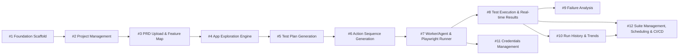

# Issues — AI-Powered E2E Test Platform

12 vertical-slice issues derived from `PRD.md`.

## Dependency Graph

## Issues

| # | Title | Type | Blocked By | Phase |
|---|-------|------|------------|-------|
| 1 | Foundation Scaffold | HITL | — | 1 |
| 2 | Project Management | AFK | 1 | 1 |
| 3 | PRD Upload & Feature Map | AFK | 2 | 2 |
| 4 | App Exploration Engine | AFK | 3 | 2 |
| 5 | Test Plan Generation | AFK | 4 | 2 |
| 6 | Action Sequence Generation | AFK | 5 | 2 |
| 7 | Worker/Agent & Playwright Runner | AFK | 6 | 3 |
| 8 | Test Execution & Real-time Results | AFK | 7 | 3 |
| 9 | Failure Analysis | AFK | 8 | 3 |
| 10 | Run History & Trends | AFK | 8 | 4 |
| 11 | Credentials Management | AFK | 7 | 4 |
| 12 | Suite Management, Scheduling & CI/CD | AFK | 8, 10 | 4 |
